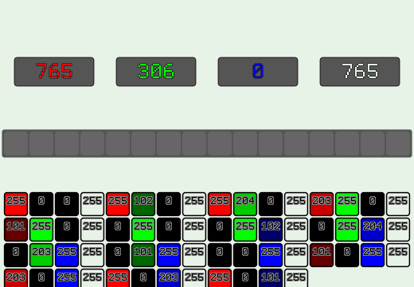

# qAverageColor [](LICENSE)

||||||
|:-:|:-:|:-:|:-:|:-:|
||Serial|SSE4.2|AVX2|AVX512|
||||||
|Processor||Speedup|
|[i7-7500u](https://en.wikichip.org/wiki/intel/core_i7/i7-7500u)|-|x2.8451|x4.4087|_N/A_|
|[i3-6100](https://en.wikichip.org/wiki/intel/core_i3/i3-6100)|-|x2.7258|x4.2358|_N/A_|
|[i5-8600k](https://en.wikichip.org/wiki/intel/core_i5/i5-8600k)|-|x2.4015|x2.6498|_N/A_|
|[i9-7900x](https://en.wikichip.org/wiki/intel/core_i9/i9-7900x)|-|x2.0651|x2.6140|x4.2704|

<sup>Tested against a synthetic 10-megapixel image, GCC version 8.2.1</sup>

This is a little snippet write-up of code that will find the average color of an image of RGBA8 pixels (32-bits per pixel, 8 bits per channel) by utilizing the `psadbw`(`_mm_sad_epu8`) instruction to accumulate the sum of each individual channel into a (very overflow-safe)64-bit accumulator.

Inspired by the ["SIMDized sum of all bytes in the array" write-up](http://0x80.pl/notesen/2018-10-24-sse-sumbytes.html) by [Wojciech Muła](https://twitter.com/pshufb).

The usual method to get the statistical average of each color channel in an image is pretty trivial:

 1. Load in a pixel
 2. Unpack the individual color channels
 3. Sum the channel values into a an accumulator
 4. When you've summed them all, divide these sums by the number of total pixels
 5. Interleave these averages into a new color value


Something like this:
```cpp
std::uint32_t AverageColorRGBA8(
	std::uint32_t Pixels[],
	std::size_t Count
)
{
	std::uint64_t RedSum, GreenSum, BlueSum, AlphaSum;
	RedSum = GreenSum = BlueSum = AlphaSum = 0;
	for( std::size_t i = 0; i < Count; ++i )
	{
		const std::uint32_t& CurColor = Pixels[i];
		AlphaSum += static_cast<std::uint8_t>( CurColor >> 24 );
		BlueSum  += static_cast<std::uint8_t>( CurColor >> 16 );
		GreenSum += static_cast<std::uint8_t>( CurColor >>  8 );
		RedSum   += static_cast<std::uint8_t>( CurColor >>  0 );
	}
	RedSum   /= Count;
	GreenSum /= Count;
	BlueSum  /= Count;
	AlphaSum /= Count;

	return
		(static_cast<std::uint32_t>( (std::uint8_t)AlphaSum ) << 24 ) |
		(static_cast<std::uint32_t>( (std::uint8_t) BlueSum ) << 16 ) |
		(static_cast<std::uint32_t>( (std::uint8_t)GreenSum ) <<  8 ) |
		(static_cast<std::uint32_t>( (std::uint8_t)  RedSum ) <<  0 );
}
```

This is a pretty serial way to do it. Pick up a pixel, unpack it, add it to a sum.

Each of these unpacks and sums are pretty independent of each other can be parallelized with some SIMD trickery to do these unpacks and sums in chunks of 4, 8, even **16** pixels at once in parallel.

There is no dedicated instruction for a horizontal sum of 8-bit elements within a vector register in any of the [x86 SIMD variations](https://en.wikipedia.org/wiki/Streaming_SIMD_Extensions#Later_versions).
The closest tautology is an instruction that gets the **S**um of **A**bsolute **D**ifferences of **8**-bit elements within 64-bit lanes, and then horizontally adds these 8-bit differences into the lower 16-bits of the 64-bit lane. This is basically computing the [manhatten distance](https://en.wikipedia.org/wiki/Taxicab_geometry) between two vectors of eight 8-bit elements.
```
AD(A,B) = ABS(A - B) # Absolute difference

X = ( 1, 2, 3, 4, 5, 6, 7, 8) # 8 byte vectors
Y = ( 8, 9,10,11,12,13,14,15)

# Sum of absolute differences
SAD(X,Y) =
	# Absolute difference of each of the pairs of 8-bit elements
	AD(X[0],Y[0]) + AD(X[1],Y[1]) + AD(X[2],Y[2]) + AD(X[3],Y[3]) +
	AD(X[4],Y[4]) + AD(X[5],Y[5]) + AD(X[6],Y[6]) + AD(X[7],Y[7])
	=
	ABS(  1 -  8 ) + ABS(  2 -  9 ) + ABS(  3 - 10 ) + ABS(  4 - 11 ) +
	ABS(  5 - 12 ) + ABS(  6 - 13 ) + ABS(  7 - 14 ) + ABS(  8 - 15 )
	=
	ABS( -7 ) + ABS( -7 ) + ABS( -7 ) + ABS( -7 ) +
	ABS( -7 ) + ABS( -7 ) + ABS( -7 ) + ABS( -7 )
	# Horizontally sum all these differences into a 16-bit value
	= 7 + 7 + 7 + 7 + 7 + 7 + 7 + 7
	= 56
```

`psadbw` may seem like a pretty niche instruction at first. You're probably wondering why such a specific series of operations is implemented as an official x86 instruction but it has had plenty of usage since the original SSE days to aid in block-based [motion estimation](https://en.wikipedia.org/wiki/Sum_of_absolute_differences) for video encoding.
The trick here is recognizing that the absolute difference between an _unsigned_ number and _zero_, is just the unsigned number again. The _sum_ of the absolute difference between a vector of unsigned values and vector-0 is a way to extract just the horizontal-addition step of SAD for this particular use.

```
(A is unsigned)
AD(A,B) = ABS(A - 0) = A

X = ( 1, 2, 3, 4, 5, 6, 7, 8) # 8 byte vectors
Y = ( 0, 0, 0, 0, 0, 0, 0, 0)

SAD(X,Y) =
	AD(X[0],0) + AD(X[1],0) + AD(X[2],0) + AD(X[3],0) +
	AD(X[4],0) + AD(X[5],0) + AD(X[6],0) + AD(X[7],0)
	=
	X[0] + X[1] + X[2] + X[3] + X[4] + X[5] + X[6] + X[7]
	=
	1 + 2 + 3 + 4 + 5 + 6 + 7
	= 28
```

This kind of utilizaton of `psadbw` will allow a vector of 8 consecutive bytes to be horizontally summed into the low 16-bits of a 64-bit lane, and this 16-bit value can then be directly added to a larger 64-bit accumulator. With this, a chunk of RGBA color values can be loaded into a vector, unpacked so that all their R,G,B,A bytes are grouped into 64-bit lanes, `psadbw` these 64-bit lanes to get 16-bit sums, and then accumulate these sums into a 64-bit accumulator to later get their average.

Usually, taking the average of a large amount of values can cause some worry for overflow. With instructions like `psadbw` that operate on 64-bit lanes, it lends itself to the usage of 64-bit accumulators which are very resistant to overflow.
An individual channel would need `2^64 / 2^8 == 72057594037927936` pixels (almost 69 billion megapixels) with a value of `0xFF` for that color channel to overflow its 64-bit accumulator.
Pretty resistant I'd say.

An SSE vector-register is 128 bits, it will be able to hold two 64-bit accumulators per vector-register so one SSE register can be used to accumulate the sum of `|Green|Red|` values and another vector-register for the `|Alpha|Blue|` sums.

The main loop would look something like this:

 1. Load in a chunk of 4 32-bit pixels into a 128-bit register
    * `|ABGR|ABGR|ABGR|ABGR|`
 2. Shuffle the 8-bit channels within the vector so that the upper 64-bits of the register has one channel, and the lower 64-bits has another.
    * There is a bit of "waste" as you only have four bytes of a particular channel and 8-bytes within a lane. These values can be set to zero by passing a shuffle-index with the upper bit set when using `_mm_shuffle_epi8`(A value such as `-1` will get `pshufb` to write `0`). This way these bytes will not effect the sum.
    * `|0G0G0G0G|0R0R0R0R|` or `|0A0A0A0A|0B0B0B0B|`
    * `|0000GGGG|0000RRRR|` or `|0000AAAA|0000BBBB|` works too
    * Any permutation in particular works so long as the unused elements do not effect the horizontal sum and are 0
 3. `_mm_sad_epu` the vector, getting two 16-bit sums within each of the 64-bit lanes, add this to the 64-bit accumulators
    * `|0000ΣG16|0000ΣR16|` or `|0000ΣA16|0000ΣB16|` 16-bit sums, within the upper and lower 64-bit halfs of the 128-bit register


A `psadbw`-accelerated pixel-summing loop that handles four pixels at a time would look something like this:



```cpp
// | 64-bit Red Sum | 64-bit Green Sum |
__m128i RedGreenSum64  = _mm_setzero_si128();
// | 64-bit Blue Sum | 64-bit Alpha Sum |
__m128i BlueAlphaSum64 = _mm_setzero_si128();

// 4 pixels at a time! (SSE)
for( std::size_t j = i/4; j < Count/4; j++, i += 4 )
{
	const __m128i QuadPixel = _mm_stream_load_si128((__m128i*)&Pixels[i]);
	RedGreenSum64 = _mm_add_epi64( // Add it to the 64-bit accumulators
		RedGreenSum64,
		_mm_sad_epu8( // compute | 0+G+0+G+0+G+0+G | 0+R+0+R+0+R+0+R |
			_mm_shuffle_epi8( // Shuffle the bytes to | 0G0G0G0G | 0R0R0R0R |
				QuadPixel,
				_mm_set_epi8(
					// Green
					-1,13,-1, 5,
					-1, 9,-1, 1,
					// Red
					-1,12,-1, 4,
					-1, 8,-1, 0
				)
			),
			// SAD against 0, which just returns the original unsigned value
			_mm_setzero_si128()
		)
	);
	BlueAlphaSum64 = _mm_add_epi64( // Add it to the 64-bit accumulators
		BlueAlphaSum64,
		_mm_sad_epu8( // compute | 0+A+0+A+0+A+0+A | 0+B+0+B+0+B+0+B |
			_mm_shuffle_epi8( // Shuffle the bytes to | 0A0A0A0A | 0B0B0B0B |
				QuadPixel,
				_mm_set_epi8(
					// Alpha
					-1,15,-1, 7,
					-1,11,-1, 3,
					// Blue
					-1,14,-1, 6,
					-1,10,-1, 2
				)
			),
			// SAD against 0, which just returns the original unsigned value
			_mm_setzero_si128()
		)
	);
}
```

After doing chunks of 4 at a time, it can handle the unaligned pixels(there will only ever be 3 or less left-over) by extracting the 64-bit accumulators from the vector-registers, and falling back to the usual serial method.
Though there are some slight optimizations that can be done here too. `bextr` can extract continuous bits a little quicker without doing a shift-and-a-mask to get the upper color channels. x86 has [register aliasing for the lower two bytes of its general purpose registers](http://flint.cs.yale.edu/cs421/papers/x86-asm/x86-registers.png) though so a `bextr` would probably be overhandling for the lower color channels in the lower bytes.

```cpp
// Extract the 64-bit accumulators from the vector registers of the previous loop
std::uint64_t RedSum64 = _mm_cvtsi128_si64(RedGreenSum64);
std::uint64_t GreenSum64   = _mm_extract_epi64(RedGreenSum64,1);
std::uint64_t BlueSum64 = _mm_cvtsi128_si64(BlueAlphaSum64);
std::uint64_t AlphaSum64  = _mm_extract_epi64(BlueAlphaSum64,1);

// New serial method
for( ; i < Count; ++i )
{
	const std::uint32_t CurColor = Pixels[i];
	AlphaSum64 += _bextr_u64( CurColor, 24, 8);
	BlueSum64  += _bextr_u64( CurColor, 16, 8);
	// I'm being oddly specific here to make it obvious for the
	// compiler to do some ah/bh/ch/dh register trickery
	//                                              V
	GreenSum64 += static_cast<std::uint8_t>( CurColor >>  8 );
	RedSum64   += static_cast<std::uint8_t>( CurColor       );
}
// Average
RedSum64   /= Count;
GreenSum64 /= Count;
BlueSum64  /= Count;
AlphaSum64 /= Count;

// Interleave
return
	(static_cast<std::uint32_t>( (std::uint8_t)AlphaSum64 ) << 24 ) |
	(static_cast<std::uint32_t>( (std::uint8_t) BlueSum64 ) << 16 ) |
	(static_cast<std::uint32_t>( (std::uint8_t)GreenSum64 ) <<  8 ) |
	(static_cast<std::uint32_t>( (std::uint8_t)  RedSum64 ) <<  0 );
```

This implementation so far with a 3840x2160 image on an [i7-7500U](https://en.wikichip.org/wiki/intel/core_i7/i7-7500u) shows an approximate **x2.6** increase in performance over the serial method. It now takes less than half the time to process an image now.
```
Serial: #10121AFF |      7100551ns
Fast  : #10121AFF |      2701641ns
Speedup: 2.628236
```

With [AVX2](https://en.wikipedia.org/wiki/Advanced_Vector_Extensions) this algorithm can be updated to process **8** pixels a time, then **4** pixels a time before resorting to the serial algorithm for unaligned data(there will only be 7 or less unaligned pixels, think [greedy algorithms](https://en.wikipedia.org/wiki/Greedy_algorithm)). With much larger **256-bit** vectors, all four 64-bit accumulators can reside within a single AVX2 register.
Though, AVX2's massive 256-bit vector-registers is almost just an alias for two regular 128-bit SSE registers from before with the additional benefit of being able to compactly handle two 128-bit registers with 1 instruction.
This also means that cross-lane arithmetic(shuffling elements across the full width of a 256-bit register, rather than staying within the upper and lower 128-bit halfs) can be tricky as crossing the 128-bit boundary needs some special attention. A solution to this is to shuffle first within the upper and lower 128-bit lanes, and then using a much larger cross-lane shuffle to further unpack the channels into continuous values before computing a `_mm256_sad_epu8` on each of the four 64-bit lanes.

```cpp
// Vector of four 64-bit accumulators for Red,Green,Blue, and Alpha
__m256i RGBASum64  = _mm256_setzero_si256();
// 8 pixels at a time! (AVX/AVX2)
for( std::size_t j = i/8; j < Count/8; j++, i += 8 )
{
	const __m256i OctaPixel = _mm256_loadu_si256((__m256i*)&Pixels[i]);
	// Shuffle within 128-bit lanes
	// | ABGRABGRABGRABGR | ABGRABGRABGRABGR |
	// | AAAABBBBGGGGRRRR | AAAABBBBGGGGRRRR |
	// Setting up for 64-bit lane sad_epu8
	__m256i Deinterleave = _mm256_shuffle_epi8(
		OctaPixel,
		_mm256_broadcastsi128_si256(
			_mm_set_epi8(
				// Alpha
				15,11, 7, 3,
				// Blue
				14,10, 6, 2,
				// Green
				13, 9, 5, 1,
				// Red
				12, 8, 4, 0
			)
		)
	);
	// Cross-lane shuffle
	// | AAAABBBBGGGGRRRR | AAAABBBBGGGGRRRR |
	// | AAAAAAAA | BBBBBBBB | GGGGGGGG | RRRRRRRR |
	Deinterleave = _mm256_permutevar8x32_epi32(
		Deinterleave,
		_mm256_set_epi32(
			// Alpha
			7, 3,
			// Blue
			6, 2,
			// Green
			5, 1,
			// Red
			4, 0
		)
	);
	// | ASum64 | BSum64 | GSum64 | RSum64 |
	RGBASum64 = _mm256_add_epi64(
		RGBASum64,
		_mm256_sad_epu8(
			Deinterleave,
			_mm256_setzero_si256()
		)
	);
}

// Pass the accumulators onto the next SSE loop from above
__m128i BlueAlphaSum64  = _mm256_extractf128_si256(RGBASum64,1);
__m128i RedGreenSum64 = _mm256_castsi256_si128(RGBASum64);
for( std::size_t j = i/4; j < Count/4; j++, i += 4 )
{
...
```


This implementation so far(AVX2,SSE,and Serial) with the same 3840x2160 image as before on an [i7-7500U](https://en.wikichip.org/wiki/intel/core_i7/i7-7500u) shows an approximate **x4.1** increase in performance over the serial method. It now takes less than a **forth** of the time to calculate the color average over the serial version!
```
Serial: #10121AFF |      7436508ns
Fast  : #10121AFF |      1802768ns
Speedup: 4.125050
```

### RGB8? RG8? R8?

Not explored in this little write-up are other pixel formats such as the three-channel `RGB` with no alpha or just a 2-channel `RG` image or even just a monochrome "R8" image of just one channel.
Other formats will work with the same principle as the `RGBA` format one so long as you account for the proper shuffling needed.

Depending on where you are at in your pixel processing, consider the different cases of how you can take a 16-byte chunk out of a stream of 3-byte `RGB` pixels
If your bytes were organized `|RGB|RGB|RGB|RGB|...` and a vector-register with a width of 16-bytes, then you'll always be taking `16/3 = 15.3333...` `RGB` pixels at once. And every **3**rd chunk (`0.333.. * 3 = 1.0`) is when the period repeats. So only 3 shuffle-masks are ever needed depending on where your index `i` lands on the array. Some ASCII art might help visualize it
```
Note how different the bytes align when taking regular 16-byte chunks out of a
stream of 3-byte pixels.
Different shuffle patterns must be used to account for each case:

 >RGBRGBRGBRGBRGBRG<
0:|---SIMD Reg.---|
  RGBRGBRGBRGBRGBRGBRGBRGBRGBRGBRGBRGBRGBRGBRGBRGBRGBRGBRGBRGBRGBRGBRGBRGBRGB...
                  >BRGBRGBRGBRGBRGBR<
1:                 |---SIMD Reg.---|
  RGBRGBRGBRGBRGBRGBRGBRGBRGBRGBRGBRGBRGBRGBRGBRGBRGBRGBRGBRGBRGBRGBRGBRGBRGB...
                                   >GBRGBRGBRGBRGBRGB<
2:                                  |---SIMD Reg.---|
  RGBRGBRGBRGBRGBRGBRGBRGBRGBRGBRGBRGBRGBRGBRGBRGBRGBRGBRGBRGBRGBRGBRGBRGBRGB...
                   This is the same as iteration 0  >RGBRGBRGBRGBRGBRG<
3:                                                   |---SIMD Reg.---|
  RGBRGBRGBRGBRGBRGBRGBRGBRGBRGBRGBRGBRGBRGBRGBRGBRGBRGBRGBRGBRGBRGBRGBRGBRGB...
```

You can also process much larger **48**-byte (`lcd(16,3)`) aligned chunks to have more productive iterations at a higher granularity:

```
Now you don't have to worry about byte-level alignment and can do all the shuffles at once
 >RGBRGBRGBRGBRGBRGBRGBRGBRGBRGBRGBRGBRGBRGBRGBRGBRGB<
0:|---SIMD Reg.---||---SIMD Reg.---||---SIMD Reg.---|
  RGBRGBRGBRGBRGBRGBRGBRGBRGBRGBRGBRGBRGBRGBRGBRGBRGBRGBRGBRGBRGBRGBRGBRGBRGB...
```
Once you got your sums, then it's just a division and interleave to turn these statistical averages into a new color value.

For RG8, the same principle applies but much more trivial since 2-byte pixels naturally align themselves with power-of-two register widths.

For R8, the summing step reduces to just be a sum-of-bytes which is a topic precisely [covered by Wojciech Muła](http://0x80.pl/notesen/2018-10-24-sse-sumbytes.html). After getting the sum, divide by the number of pixels to get the statistical average.

# AVX512 VNNI (Icelake)

The upcoming Intel Icelake features **V**ector **N**eural **N**etwork **I**nstructions in consumer-level products.
The AVX512 extension is very small, featuring only 4 instructions.

Instruction|Description
-|-
`VPDPBUSD`	| **Multiply and add unsigned and signed 8-bit integers**
`VPDPBUSDS`	| Multiply and add unsigned and signed 8-bit integers with saturation
`VPDPWSSD`	| Multiply and add signed 16-bit integers
`VPDPWSSDS`	| Multiply and add 16-bit integers with saturation

These instructions are [intended to accelerate convolutional neural network workloads](https://aidc.gallery.video/detail/videos/all-videos/video/5790616836001/understanding-new-vector-neural-network-instructions-vnni) which typically involves mixed-precision arithmetic and matrix multiplications. These four new instructions basically implement 8 or 16 bit dot-products into 32-bit accumulators which falls nicely into the domain of summing bytes together.

[VPDPBUSD](https://github.com/HJLebbink/asm-dude/wiki/VPDPBUSD) calculates the dot product of sixteen 8-bit ℝ⁴ vectors and accumulates them upon a vector of 32-bit values, all in one instructions. It practically lends itself to our "sum of bytes" problem.


The [_mm512_dpbusd_epi32](https://software.intel.com/sites/landingpage/IntrinsicsGuide/#text=_mm512_dpbusd_epi32&expand=2195) intrinsic is described as:

```
Synopsis
__m512i _mm512_dpbusd_epi32 (__m512i src, __m512i a, __m512i b)
#include <immintrin.h>
Instruction: vpdpbusd zmm {k}, zmm, zmm
CPUID Flags: AVX512_VNNI

Description
Multiply groups of 4 adjacent pairs of unsigned 8-bit integers in a with corresponding signed 8-bit integers in b, producing 4 intermediate signed 16-bit results. Sum these 4 results with the corresponding 32-bit integer in src, and store the packed 32-bit results in dst.

Operation
FOR j := 0 to 15
	tmp1 := a.byte[4*j] * b.byte[j]
	tmp2 := a.byte[4*j+1] * b.byte[j+1]
	tmp3 := a.byte[4*j+2] * b.byte[j+2]
	tmp4 := a.byte[4*j+3] * b.byte[j+3]
	dst.dword[j] := src.dword[j] + tmp1 + tmp2 + tmp3 + tmp4
ENDFOR
dst[MAX:512] := 0
```

By passing a vector of `1` values into the multiplication step, the implementation basically becomes:
```
FOR j := 0 to 15
	tmp1 := a.byte[4*j] * 1
	tmp2 := a.byte[4*j+1] * 1
	tmp3 := a.byte[4*j+2] * 1
	tmp4 := a.byte[4*j+3] * 1
	dst.dword[j] := src.dword[j] + tmp1 + tmp2 + tmp3 + tmp4
ENDFOR
dst[MAX:512] := 0
```

Which is essentially:

```
FOR j := 0 to 15
	dst.dword[j] := src.dword[j] + a.byte[4*j] + a.byte[4*j+1] + a.byte[4*j+2] + a.byte[4*j+3]
ENDFOR
dst[MAX:512] := 0
```

Which basically turns it into a "sum 16 groups of 4 bytes and add this sum into another 16 32-bit values" instruction. Before we would have had to shuffle our bytes into appropriate lanes, `_mm***_sad_epu8` them, and then use a separate `_mm***_add_epi64` to add it to the accumulator. But this will save us from the additional add step. Though, the accumulator is only 32-bits rather than 64. It is twice as susceptible to overflow but it can be mitigated by only running an inner loop of this instruction a certain number of times guarenteed to be safe from overflow, and then adding this to the outer-loop's 64-bit accumulator.

```cpp
// The usual shuffle pattern from the sad_epu8 method
// Each "R" "G" "B" "A" value is an 8-bit channel-byte
// | AAAA | AAAA | BBBB | BBBB | GGGG | GGGG | RRRR | RRRR | AAAA | AAAA | BBBB | BBBB | GGGG | GGGG | RRRR | RRRR |
__m512i Deinterleave = _mm512_shuffle_epi8(
	HexadecaPixel,
	_mm512_set_epi32(
		// Alpha
		0x3C'38'34'30 + 0x03'03'03'03, 0x2C'28'24'20 + 0x03'03'03'03,
		// Blue
		0x3C'38'34'30 + 0x02'02'02'02, 0x2C'28'24'20 + 0x02'02'02'02,
		// Green
		0x3C'38'34'30 + 0x01'01'01'01, 0x2C'28'24'20 + 0x01'01'01'01,
		// Red
		0x3C'38'34'30 + 0x00'00'00'00, 0x2C'28'24'20 + 0x00'00'00'00,
		// Alpha
		0x1C'18'14'10 + 0x03'03'03'03, 0x0C'08'04'00 + 0x03'03'03'03,
		// Blue
		0x1C'18'14'10 + 0x02'02'02'02, 0x0C'08'04'00 + 0x02'02'02'02,
		// Green
		0x1C'18'14'10 + 0x01'01'01'01, 0x0C'08'04'00 + 0x01'01'01'01,
		// Red
		0x1C'18'14'10 + 0x00'00'00'00, 0x0C'08'04'00 + 0x00'00'00'00
	)
);
```

```
Basic pattern of the partial sums found within a 256-bit lane
|                      256 bits                         |
| AAAA | AAAA | BBBB | BBBB | GGGG | GGGG | RRRR | RRRR | <
| **** | **** | **** | **** | **** | **** | **** | **** | |
| 1111 | 1111 | 1111 | 1111 | 1111 | 1111 | 1111 | 1111 | |
| hadd | hadd | hadd | hadd | hadd | hadd | hadd | hadd | |
|ASum32|ASum32|BSum32|BSum32|GSum32|GSum32|RSum32|RSum32| < Inner loop, 32-bit sum
|   \  +  /   |   \  +  /   |   \  +  /   |   \  +  /   | | Sum Adjacent pairs
|   ASum64    |   BSum64    |   GSum64    |   RSum64    | < Outer loop, 64-bit sum
```

As of now(`Wed 19 Jun 2019 10:15:53 PM PDT`) there is no publicly available
Icelake hardware to test this on but just in terms of uops this _should_ be
a lot faster than the sad_epu-method.

Update: As of now(`Wed 07 Aug 2019 04:49:23 PM PDT`) there is still no publicly
available hardware to test this on, but based on [some public benchmarks](https://www.anandtech.com/show/14664/testing-intel-ice-lake-10nm/3) there is now some [latency data](https://github.com/InstLatx64/InstLatx64/blob/master/GenuineIntel00706E5_IceLakeY_InstLatX64.txt) for the key instructions in the algorithm.

On Skylake-X:
 * `vpsadbw *mm, *mm, *mm` has a latency of **3**-cycles and a throughput of **1.0**
 * `vpaddq (x|y)mm, (x|y)mm, (x|y)mm` has a latency of **1**-cycle and a throughput of **0.33**
 * `vpaddq zmm, zmm, zmm` has a latency of **1**-cycle and a throughput of **0.5**

**4 cycles**

On Icelake:
 * `vpsadbw *mm, *mm, *mm` and `vpaddq *mm, *mm, *mm` have the same latencies and throughput as Skylake-X
 * `vpdpbusd (x|y)mm, (x|y)mm, (x|y)mm` has a latency of **5**-cycles and a throughput of **0.5**
 * `vpdpbusd zmm, zmm, zmm` has a latency of **5**-cycles and a throughput of **1.0**

**5 cycles**

It looks like ultimately, by having an instruction that fuses previous two
instructions to achieve a horizontal-byte-addition, we end up with an extra cycle though it saves the additional instruction decoding.

This doesn't consider the overhead of the outer-loops either. Once I get one of
the new Icelake laptops in my hands I can get some much harder benchmark numbers
of how the two algorithms perform on the same Icelake hardware.
